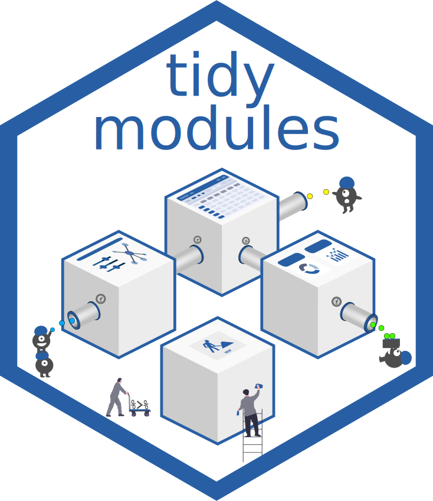

<!-- README.md is generated from README.Rmd. Please edit that file -->
tidymodules 
=========================================================================

The tidymodules R package is built on top of shiny modules using R6 to
provide a new object-oriented programming (OOP) approach for module
development, new module interface using input/output ports and a set of
tidy operators for handling cross-module communication.

The main features of tidymodules and its comparison with conventional
Shiny modules are presented in the table below.

<table>
<colgroup>
<col style="width: 1%" />
<col style="width: 9%" />
<col style="width: 52%" />
<col style="width: 36%" />
</colgroup>
<thead>
<tr class="header">
<th>Features</th>
<th></th>
<th>tidymodules</th>
<th>Conventional modules</th>
</tr>
</thead>
<tbody>
<tr class="odd">
<td><a href="articles/intro.html"><i style="color:#285fa4;" class="fas fa-laptop-code fa-2x"></i></a></td>
<td>Programming style</td>
<td>- R6 OOP *   - Semantic reference</td>
<td>Functional</td>
</tr>
<tr class="even">
<td><a href="articles/namespace.html"><i style="color:#285fa4;" class="fas fa-th-large fa-2x"></i></a></td>
<td>Namespace management</td>
<td>- automatic/generated   - ID based lookup   - Grouping</td>
<td>- manual management   - must match between ui and server</td>
</tr>
<tr class="odd">
<td><a href="articles/communication.html"><i style="color:#285fa4;" class="fas fa-directions fa-2x"></i></a></td>
<td>Module communication</td>
<td>- new module input/output port structure   - module ports linked via tidy operators   - automatic network diagram</td>
<td>- parameter passing via module server()   - challenging to manage for complex app</td>
</tr>
<tr class="even">
<td><a href="articles/inheritance.html"><i style="color:#285fa4;" class="fas fa-sitemap fa-2x"></i></a></td>
<td>Inheritance</td>
<td>- class inheritance   - port inheritance for nested modules</td>
<td>NA</td>
</tr>
<tr class="odd">
<td><a href="articles/session.html"><i style="color:#285fa4;" class="fas fa-users fa-2x"></i></a></td>
<td>Session management</td>
<td>- flexible user session management   - Caching of modules coming soon</td>
<td>NA</td>
</tr>
</tbody>
</table>

\* OPP = Object Oriented Programming

Installation
------------

You can install the most recent version of *tidymodules* from
[GitHub](https://github.com/Novartis/tidymodules) with:

    library(devtools)
    install_github("Novartis/tidymodules")

Examples
--------

You can quickly launch an example after installing the R package by
running the following.

    tidymodules::showExamples(4)

Some examples have been deployed on shinyapp.io, such as:

-   Example 1: Simple addition
    [<i class="fas fa-rocket"></i>](https://tidymodules.shinyapps.io/1_simple_addition/)
-   Example 2: Linked scatter
    [<i class="fas fa-rocket"></i>](https://tidymodules.shinyapps.io/2_linked_scatter/)
-   Example 2: Nested module
    [<i class="fas fa-rocket"></i>](https://tidymodules.shinyapps.io/3_nested_modules/)
-   Example 4: Module communication
    [<i class="fas fa-rocket"></i>](https://tidymodules.shinyapps.io/4_communication/)

Learning More
-------------

Please review the [Get Started](articles/tidymodules.html) page for a
high level introduction to tidymodules and its usage in developing Shiny
apps.

If you are interested to develop modules using tidymodules, we recommend
reading the vignettes under “Articles”.

Code of Conduct
---------------

Please note that the *tidymodules* package is released with a
[Contributor Code of Conduct](CODE_OF_CONDUCT.md). By contributing to
this project, you agree to abide by its terms.

Acknowledgment
--------------

-   The SCC team members @ NVS for their valuable feedbacks
-   2019 Summer interns (Marzi, Stephen and Renan) for contributing to
    testing the framework and implementing the demo example 4 listed
    above.
-   Eric Nantz for accepting to present tidymodules in his
    [e-poster](https://rpodcast.shinyapps.io/highlights.shiny) @
    rstudio::conf 2020
