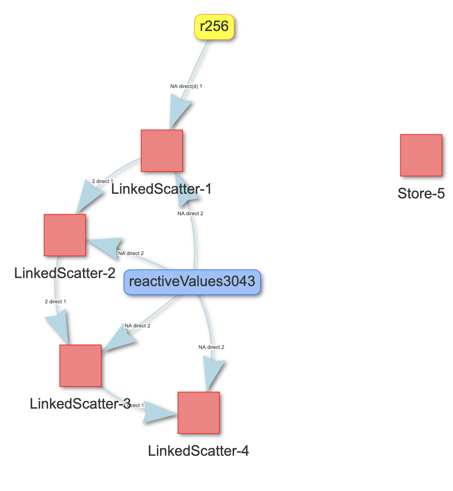
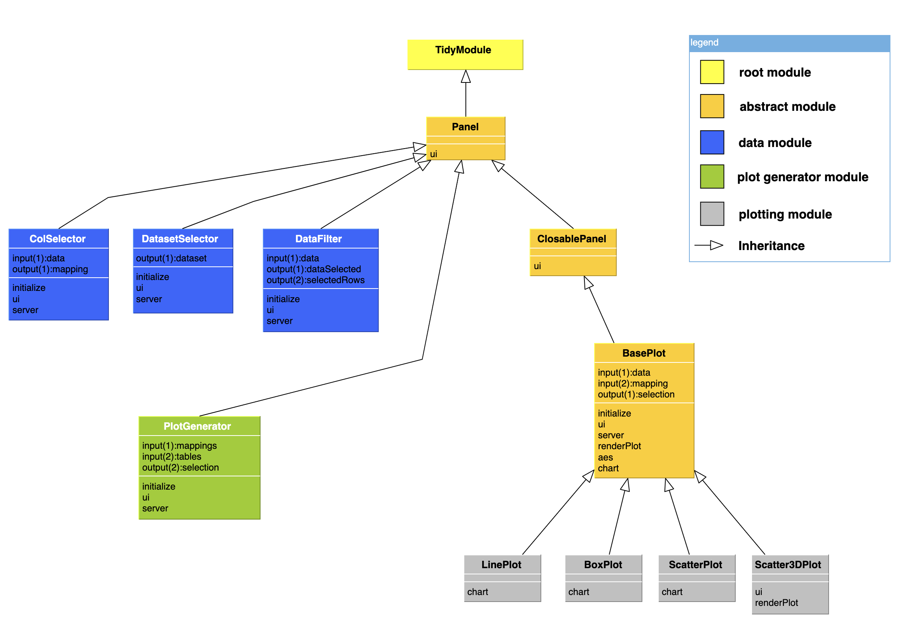

```{r setup, include = FALSE}
knitr::opts_chunk$set(
  collapse = TRUE,
  comment = "#>"
)
```

## Overview 

This vignette aims to provide a high level introduction to tidymodules. We recommend reading this article for anyone who is new to tidymodules, especially those tidymodules module "consumers", who use existing module classes as a "black-box" in their Shiny app development. This article includes the following topics:

- TidyModule ports: key infrastructure for managing cross-module communication
- How to use tidymodules modules as a Shiny app developer and tidymodules consumer
- Existing examples

If you would like to develop new tidymodules modules, please refer to the vignettes under "Articles".

## TidyModule structure: ports

### Introducing ports

In conventional Shiny modules, communication between modules is realized through the following

- **Input:** passing reactives as functional parameters into the Shiny `callModule()` function 
- **Output:** returning reactives in the module `server()` function. 

It can be challenging to keep track of the arbitrary number of input and output reactives for complex apps with many interacting modules. 

To address this challenge, we introduced input/output ports as fields of the TidyModule class object in tidymodules.
The concept is illustrated in the following diagram. In this example, Module1 and Module2 each have input and output ports that hold reactives. 
The ports defined in each modules provides a data structure that allow TidyModule to establish a communication between them.


The two modules are connected via a tidymodules pipe operator `%x>y%` where x and y could be any numbers from 1 to 10. For example,`%1>1%` means the left module's first output port (x = 1) is mapped to the first input port (y = 1) of the right module. Multiple connected tidymodules modules with such directed edges form a directed graph network, which will be further discussed later in this article. 

### Finding out ports of a tidymodules module

To find out the port structure, simply print the module object on the console. The following example shows that the `Addition` module has one input port named "left" and one output port named "total" that are both empty, i.e. not being assigned an input reactive (input ports) or injected into the server code (output ports).
```{r}
library(shiny)
library(tidymodules)
source(system.file(package = "tidymodules", "shiny/examples/1_simple_addition/Addition.R"))
Addition$new()
```


## Using tidymodules modules 

The basic workflow of using tidymodules modules in a Shiny app is the following

- Load tidymodules module class definition
- Identify module structure such as input/output ports, ui(), and server() functionalities
- Instantiate new module objects from tidymodules classes
- Construct app `ui()` using module `ui()` methods
- In app `server()` inject tidymodules module `server()` logic using `callModules()` or the `callModule()` function of the module object, like `myMod$callModule()`.
- Set up module communication/relationship via tidymodules pipe operators and functions.

The workflow is illustrated in the following example, which is available at 

Example 1: Simple addition [<i class="fas fa-rocket"></i>](https://tidymodules.shinyapps.io/1_simple_addition/)

### Load module definition

```{r, eval=FALSE}
library(tidymodules)
# source tidymodules Addition module definition
source(system.file(package = "tidymodules", "shiny/examples/1_simple_addition/Addition.R"))
```

### Instantiate module objects

Notice that the namespace argument in `$new()` is optional and `tidymodules` will automatically generate a namespace ID if not provided. 
```{r, eval=T}
# Instantiate two Addition module objects
Addition$new()
Addition$new()
```
Also notice that it is not necessary to give a name to the `Addition$new()` object. `tidymodules` provides `mod()` or `getMod()` function to help users conveniently retrieve module objects via their numerical ID or namespace ID.

### Adding `ui()`

In the app `ui()`, we call the `ui()` method of each module object. 
```{r, eval=FALSE}
ui <- fixedPage(
  h2("tidymodules : Addition example"),
  shiny::fluidRow(
    sliderInput("first_number", label = "Enter your first number", min = 1, max = 100, value = 1), br(),

    # Calling module ui() methods
    mod(1)$ui(), br(),
    mod(2)$ui(), br(),
    "Total: ", textOutput("total_result")
  )
)
```

### Add module `server()` logic using `callModules()`
Here we use the `callModules()` function to call the server() methods for the two modules that we created.
```{r, eval=FALSE}
server <- function(input, output, session) {
  # call the server() functions for all existing tidymodules modules in the global environment
  callModules()
}
```

### Establish cross-module communication via 'tidy' pipe operators

The module communication is established through the pipe operators: `first %>1% mod(1) %1>1% mod(2)`. Note that in  `first` must be a Shiny reactive value or endpoint in order to server as an input to other tidymodules modules.
```{r, eval=FALSE}
server <- function(input, output, session) {
  # call the server() functions for all existing tidymodules modules in the global environment
  callModules()

  first <- reactive({
    req(input$first_number)
  })

  # Setting up module commmunication
  observe({
    first %>1% mod(1) %1>1% mod(2)
  })

  output$total_result <- renderText({
    result <- mod(2)$getOutput(1)
    result()
  })
}

shinyApp(ui, server)
```

We also provide utility functions to help identify and connect ports using the port names. For more information about the pipe operators, refer to the functional documentation under "Reference" tab.

### Module relational network

Tidymodules module objects are mananged by `ModStore` in tidymodules. For example, in the  
example 2 - Linkled scatter [<i class="fas fa-rocket"></i>](https://tidymodules.shinyapps.io/2_linked_scatter/) you can find the sessions, module objects, edges and port mapping diagram in the "Help | ModStore" tab. 

Below is the module relationship network digram generated by `tidymodules` using the `visNetwork` package.



### Inheritance and Entity Relational Diagram

For more details about class and ports inheritance, see article [inheritance](inheritance.html).
The diagram below illustrates the relation between the classes defined in the example 4 of tidymodules [<i class="fas fa-rocket"></i>](https://tidymodules.shinyapps.io/4_communication/).



## Other examples

You can list all Shiny examples that come with the `tidymodules` package by the `showExamples()` function. We recommend going through these examples to help you understand the use patterns.
```{r}
showExamples()
```

We have already used the first example to illustrate the basic usage of tidymodules, below we briefly describe the other examples.

### Example 2: linked scatter plot

This example illustrates the tidymodules implementation of the classical Shiny module example of [two linked scatter plots](https://shiny.rstudio.com/gallery/module-example.html). 

### Example 3: nested modules

This example [<i class="fas fa-rocket"></i>](https://tidymodules.shinyapps.io/3_nested_modules/) illustrates constructing and using nested modules in the `tidymodules` framework, as well as dynamically creating tidymodules modules. 

### Example 4: module communication

This is a comprehensive example [<i class="fas fa-rocket"></i>](https://tidymodules.shinyapps.io/4_communication/) to illustrate mutiple advanced features such as

- Inheritance
- Port operations: `combine_ports()`
- Enable/disable module communication
